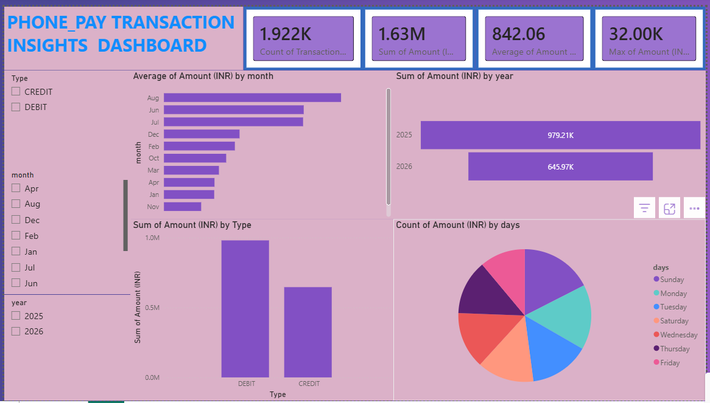

# PhonePe-Transaction-Analysis-Dashboard
Developed an interactive dashboard using PhonePe transaction data to analyze spending patterns, transaction volumes, payment categories, monthly trends, and financial behavior. Performed data cleaning, transformation, and visualization to generate actionable insights into digital payment activities.


## 🎯 Business Problem

Digital payment platforms generate large volumes of transaction data. Understanding transaction behavior helps identify spending patterns, transaction trends, and financial performance.

This dashboard was built to answer the following business questions:

- What is the total transaction volume?
- How much money was transacted?
- Which months have the highest transaction activity?
- How do Debit and Credit transactions compare?
- How does transaction behavior vary by year and day of the week?

---

## 📂 Dataset Information

The dataset contains the following fields:

- Transaction ID
- Transaction Date
- Transaction Type (Debit/Credit)
- Transaction Amount (INR)
- Month
- Year
- Day of Week

### Total Records
- 1,922 Transactions

---

## 📈 Dashboard KPIs

| KPI | Value |
|------|--------|
| Total Transactions | 1.92K |
| Total Transaction Amount | ₹1.63M |
| Average Transaction Amount | ₹842.06 |
| Maximum Transaction Amount | ₹32K |

---

## 📊 Dashboard Features

### KPI Cards
- Total Transactions
- Total Transaction Amount
- Average Transaction Amount
- Maximum Transaction Amount

### Visualizations
- Average Transaction Amount by Month
- Total Transaction Amount by Year
- Transaction Amount by Type
- Transaction Distribution by Day of Week

### Interactive Filters
- Transaction Type
- Month
- Year

---

## 🛠 Tools & Technologies

| Tool | Purpose |
|--------|---------|
| Power BI | Dashboard Development |
| Power Query | Data Transformation |
| DAX | KPI & Measure Creation |
| Excel | Data Source |

---

## 📌 Key Insights

- Debit transactions contribute the highest transaction amount.
- August recorded the highest average transaction amount.
- Total transaction value exceeded ₹1.63 Million.
- Transaction activity is distributed across all weekdays.
- Average transaction amount is ₹842 per transaction.

---

## 🖼 Dashboard Preview



---

## 💡 Skills Demonstrated

- Data Cleaning
- Data Transformation
- Power Query
- DAX Measures
- Data Modeling
- KPI Development
- Dashboard Design
- Data Visualization
- Business Insight Generation

---

## 🚀 Conclusion

This Power BI dashboard provides a comprehensive view of PhonePe transaction activity and demonstrates practical skills in data cleaning, data transformation, DAX calculations, KPI reporting, and interactive dashboard development.

---

## 📁 Repository Structure

```text
PhonePe-Transaction-Insights/
│
├── README.md
├── dashboard.png
├── PhonePe_Dashboard.pbix
└── Dataset.xlsx
```
